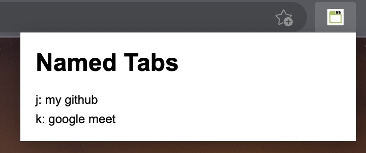

# g2tab

g2tab is a chrome extension that loads up keyboard-key to search-text-over-url mappings for consistent keystrokes access to your website. 

After pressing a key, `g2tab` searches for the mapped search text, if an existing tab that contains the search text is found, it will navigate to the tab ( even if it is in another window ).

If none is found, it will open up a new tab with the configured url.

Additionally, the pop up provides you with a view of the key mappings.

# Why

It's more economical to conserve your brain juice for higher level cognition instead of spending it on low level task like navigation. One way to do this is to establish muscle memory for common navigation task. 

Instead of mindlessly tabbing or searching to get to your commonly used web sites, `g2tab` allows you to get to your website using the same sequence of keystrokes - shortcut to trigger the extension + a letter(your mapping). 

# Status

This extension is not published in chrome webstore, so if you want to use it, clone this repo, update the config/mappings.json file to reflect you commonly used websites and follow the `local development` steps below.

# Local Development

## Build

`npm run build` 

## Try it out locally in chrome

1. Open Chrome and navigate to chrome://extensions.
2. Enable "Developer mode" in the top-right corner.
3. Click "Load unpacked" and select your extension's root directory.

Now you should see the extension in your browser's toolbar. Click on the extension icon, enter a URL fragment in the search input, and it will display a list of matching tabs. Clicking on a search result will open the corresponding tab in a new window.

# Credits

Chat Gpt - for that coding assistance

